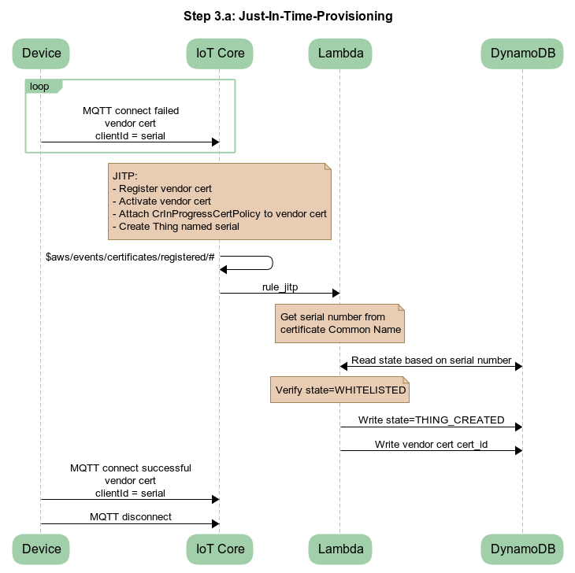

# Introduction

This repository contains the files for the "Secure and Consistent IoT Device On-
boarding with Just-In-Time-Provisioning (JITP) and Certificate Rotation" blog. 
Included are all the files necessary to create the cloud components, initialize 
the cloud with a device, and simulate the device on-boarding to the cloud.

The IAM user executing this code needs privileges for AWS IoT Core, IoT Rules, 
IoT Registered Certificate Authority (CA), IoT Certificates, IoT Certificate 
Policies, JITP, IoT Things, AWS Lambda, AWS DynamoDB, AWS Cloudformation, and 
AWS System Manager (SSM) parameter store, and AWS CLI access.

OpenSSL command line and OpenSSL python module perform X.509 certificate related
actions, which include creating self-signed certificate authority (CA) 
certificates, certificate signing requests (CSR), certificates, and private keys. 
CA private keys are stored in SSM parameter store.

A reference architecture is below:


# Setup

Python 3.6 or newer is required.

Install the AWS CLI using these instructions:

```
https://docs.aws.amazon.com/cli/latest/userguide/cli-chap-install.html
```
Install OpenSSL command line on the machine acting like the linux device.

```
https://www.howtoforge.com/tutorial/how-to-install-openssl-from-source-on-linux/
http://macappstore.org/openssl/
```
Issues with OpenSSL configuration file may occur. For resolution tips, read this
file in the blog code:

```
~/aws_cloud/certs_etc/OpenSSLCommands.txt
```

If you are using a Mac, then install docker from here:

```
https://hub.docker.com/editions/community/docker-ce-desktop-mac
```
Clone this repository on your MacOS or Linux machine:

```
https://github.com/aws-samples/iot-device-on-boarding
```

The directory structure of the code is:

```
~/aws_cloud/cloud_formation/cert_rotation_lambda
~/aws_cloud/cloud_formation
~/aws_cloud/certs_etc
~/linux_devce
```
Determine the best S3 bucket name for your deployment following these rules:

```
https://docs.aws.amazon.com/AmazonS3/latest/dev/BucketRestrictions.html#bucketnamingrules
```

Edit the below file and modify the variable named S3_BUCKET.

```
~/aws_cloud/cloud_formation/config.bash
```

Create a new virtual python3 environment in the root directory of this repo then source 
that environment. 

```
https://docs.aws.amazon.com/elasticbeanstalk/latest/dg/python-development-environment.html
```
Install python modules. 


```
> cd ~/aws_cloud/certs_etc
> sudo pip3 install -r requirements.txt
> cd ~/linux_device
> sudo pip3 install -r requirements.txt
```

If installing on a linux machine, then run the following:

```
> cd ~/aws_cloud/cloud_formation/cert_rotation_lambda
> sudo pip3 install -r requirements.txt -t ./package
```

If installing on a Mac, then you have to spin-up a docker container to install the lambda python modules to run on ubuntu, which is the default AWS lambda instance. Install docker then, do the following:

```
> cd ~/aws_cloud/cloud_formation/cert_rotation_lambda
> pwd
> docker run -v <full path name to cert_rotation_lambda dir>:/lambda -it --rm ubuntu
> apt-get update && apt-get install -y -qq python3-pip git && cd /usr/local/bin && ln -s /usr/bin/python3 python && python3 -m pip install --upgrade pip && python3 -m pip install ipython && rm -rf /var/lib/apt/lists/* 
> apt-get update && apt-get install zip 
> cd /lambda
> pip3 install -r requirements.txt -t ./package
> exit
```

## Deploy Cloud

Two steps to deploy the code:
1) Start cloud formation

```
    > cd ~/aws_cloud/cloud_formation
    > bash deploy_cf.bash
```
2) Initialize the system

```
    > cd ~/aws_cloud/cloud_formation
    > python certs_etc.py --create
```

# On-Board a Device
Device on-boarding has three steps:

1) JITP device & certificate

```
    > cd ~/linux_device
    > python mqtt_client.py --jitp
```



2) Create manufacturer certificate

```
    > python mqtt_client.py --create_cert
```


3) Acknowledge manufacturer certificate

```
    > python mqtt_client.py --ack_cert
```


To run the on-boarding code a again, then do this:

```
    > cd ~/aws_cloud/certs_etc
    > python certs_etc.py -—delete
    > python certs_etc.py -—create
```

# Clean-up
Two steps to cleanup everything in the AWS account:
1) Remove devices and certificates in IoT Core

```
    > cd ~/aws_cloud/certs_etc
    > python certs_etc.py -—delete
```
2) Tear down cloud formation

```
    > cd ~/aws_cloud/cloud_formation
    > bash delete_cf.bash
```
